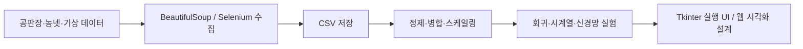

# 빅데이터 기반 농산물 가격 예측

> 공판장 가격과 기상 데이터를 수집·전처리하고, 회귀 모델을 비교해 농산물 가격 흐름을 탐색한 2022년 팀 프로젝트입니다.

## 🧭 프로젝트 한눈에 보기

| 항목 | 내용 |
|---|---|
| 개발 기간 | 2022.10.25 - 2022.11.18 (4주) |
| 개발 형태 | 4인 팀 프로젝트, 팀장 |
| 목표 | 기상·가격 데이터의 관계를 분석하고 농산물 가격 예측 모델을 비교 |
| 담당 | 기획·일정·요구사항 관리, UI 설계, 데이터 수집 모듈, 가격 예측 실행 UI |
| 현재 상태 | 원본 데이터와 학습 모델을 제외한 대표 소스·화면 아카이브 |

## 🔗 주요 링크

| 구분 | 링크 |
|---|---|
| 프로젝트 협업 문서 | [Notion에서 보기](https://ezendteam.notion.site/2-d08346e27402433abe52758f4e1d9697) |
| 데이터 수집 소스 | [`src/collection`](src/collection) |
| 전처리 소스 | [`src/preprocessing`](src/preprocessing) |
| 분석·예측 소스 | [`src/analysis`](src/analysis) |
| 직접 구현한 예측 UI | [`predict_ui.py`](src/analysis/sklearn/predict_ui.py) |

## 💡 왜 만들었나

농산물 가격은 날씨, 출하량, 거래량처럼 여러 조건에 따라 크게 달라집니다. 과거 가격만 보는 데서 그치지 않고 공판장·기상 데이터를 한 흐름으로 모아, 어떤 변수가 가격과 관계가 있는지 확인하고 여러 예측 방법을 비교하고자 했습니다.

## ✨ 데이터 처리 흐름

| 단계 | 구현 내용 |
|---|---|
| 수집 | 공판장 선택과 품목 입력을 받아 거래 데이터를 크롤링 |
| 전처리 | 날짜 형식 통일, 결측치 처리, 기상·가격 데이터 병합, 스케일링·시프팅 |
| 분석 | Pearson 상관계수와 히트맵으로 변수 관계 확인 |
| 예측 | Linear, Ridge, Lasso와 시계열·신경망 실험 코드 비교 |
| 표현 | 가격 목록, 예측 그래프, 과거 가격, 영향 변수 화면 설계 |

## 🙋 담당 영역

- 팀장으로 기획, 일정, 요구사항과 역할 분배를 관리했습니다.
- 공판장 데이터 수집 모듈과 가격 예측 실행 UI를 구현했습니다.
- `predict_ui.py`에서 입력 변수를 선택하고 학습·검증 비율을 조절한 뒤 Linear/Ridge/Lasso 결과를 비교하도록 구성했습니다.
- 웹 화면의 정보 구조와 농산물 목록·상세 화면 레이아웃을 설계했습니다.

## 🖼️ 화면과 분석

### 공판장 수집 도구

### 가격 예측 상세 화면

### 결측치 보정 전·후 상관관계

## 🏗️ 분석 구조

## 🛠️ 기술 스택

| 영역 | 기술 | 사용 목적 |
|---|---|---|
| 수집 | Requests, BeautifulSoup, Selenium | 공판장·공공 데이터 수집 |
| 처리 | pandas, NumPy | 정형 데이터 정제·병합·변환 |
| 분석 | scikit-learn, statsmodels, TensorFlow | 회귀·시계열·신경망 모델 실험 |
| 시각화 | Matplotlib, Seaborn, Tkinter | 상관관계·예측 결과와 실행 옵션 표현 |
| 협업 | GitHub, Notion, Slack | 코드·일정·문서 관리 |

## 🔎 공개 범위

용량이 큰 원본 CSV, 학습 모델, 캐시와 출처가 불명확한 참고 자료는 공개 대상에서 제외했습니다. 이 저장소는 대표 소스와 당시 화면을 통해 설계·구현 과정을 보여주는 포트폴리오 아카이브이며, 현재 데이터로 재학습한 성능을 주장하지 않습니다. 팀 프로젝트 코드에는 별도 오픈소스 라이선스를 부여하지 않습니다.

