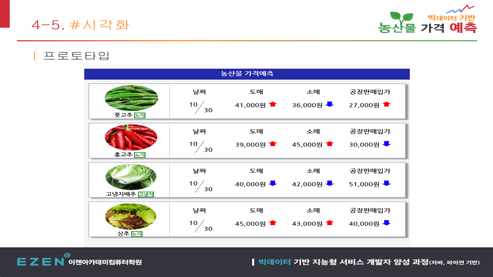
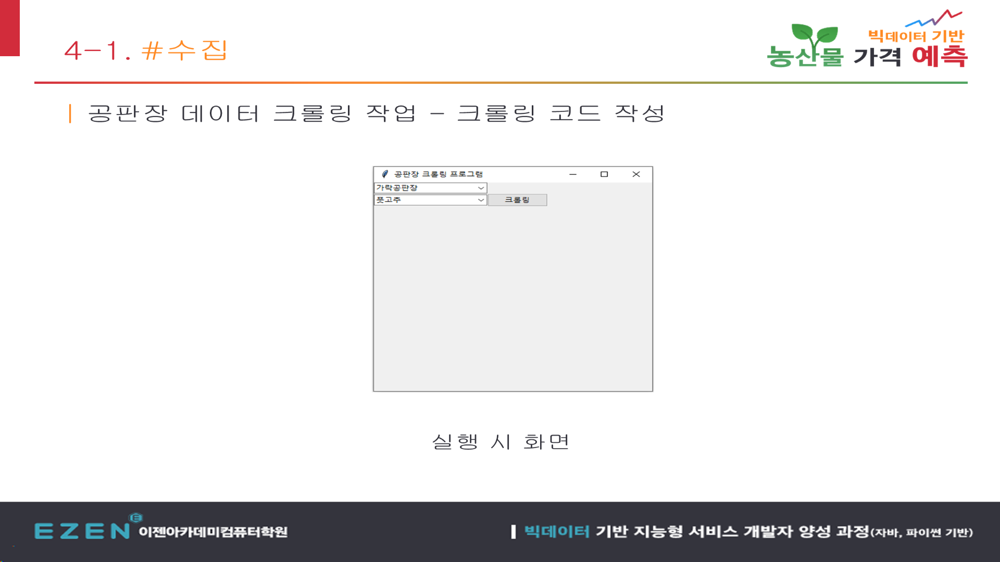
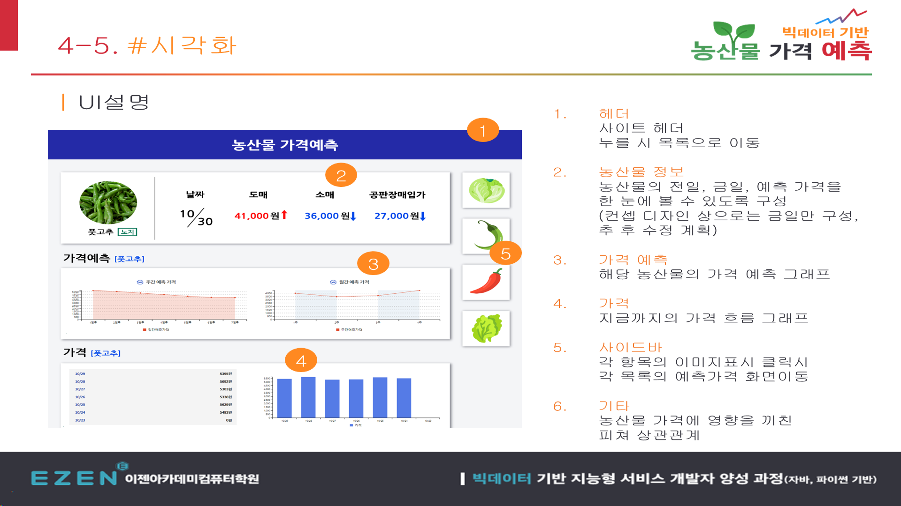
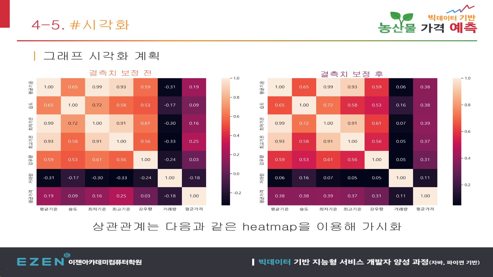

# 빅데이터 기반 농산물 가격 예측 실험

> 농산물 경매·기상 데이터를 수집하고 동일한 데이터 분할에서 Linear, Ridge, Lasso를 비교하는 실행 도구를 만든 2022년 팀 프로젝트입니다.

## 🧭 프로젝트 개요

| 항목 | 내용 |
|---|---|
| 개발 기간 | 2022.10.25 - 2022.11.18 (4주) |
| 개발 형태 | 4인 팀 프로젝트, 팀장 |
| 목표 | 경매·기상 데이터 수집과 동일 조건의 회귀 모델 비교 |
| 본인 담당 | 기획·일정·요구사항, UI 설계, 데이터 수집 모듈, Tkinter 예측 UI |
| Git 기록 | `predict_ui.py` 본인 비병합 커밋 7개 |
| 현재 상태 | 원본 데이터와 실행 환경을 제외한 코드·화면 아카이브 |

## 🔗 주요 링크

| 구분 | 링크 |
|---|---|
| 프로젝트 협업 문서 | [Notion에서 보기](https://ezendteam.notion.site/2-d08346e27402433abe52758f4e1d9697) |
| 데이터 수집 소스 | [`src/collection`](src/collection) |
| 전처리 소스 | [`src/preprocessing`](src/preprocessing) |
| 분석·예측 소스 | [`src/analysis`](src/analysis) |
| 본인 예측 UI | [`predict_ui.py`](src/analysis/sklearn/predict_ui.py) |

## 💡 왜 만들었나

농산물 경매 가격은 품목과 시기, 기상 조건에 따라 크게 달라집니다. 한 모델의 결과만 제시하기보다 실제 데이터를 모으고 같은 입력과 학습·검증 구간에서 여러 회귀 모델을 비교할 수 있는 실험 도구를 만들고자 했습니다.

## 🙋 확인되는 본인 구현 범위

- 팀장으로 일정, 요구사항, 유스케이스와 UI 설계 관리
- 공판장과 품목을 선택해 거래 데이터를 CSV로 저장하는 수집 모듈 구현
- 사용할 기상 변수를 고르고 학습·검증 비율을 조절하는 Tkinter UI 구현
- Linear, Ridge, Lasso를 같은 데이터 구간에서 학습·예측하도록 연결
- `predict_ui.py` 생성부터 수정까지 본인 비병합 커밋 7개

본인 역할은 D팀 중간발표 8번 슬라이드의 역할표와 Git 이력으로 교차 확인했습니다.

## 🧩 구현 흐름

| 단계 | 보존 내용 | 상태 |
|---|---|---|
| 수집 | 공판장 선택·품목 입력·CSV 저장 | 코드와 당시 실행 화면 확인 |
| 전처리 | 날짜 통일, 결측치 처리, 기상·가격 병합, 스케일링 | 팀 소스 확인 |
| 분석 | 상관관계와 회귀·시계열·신경망 실험 | 팀 소스 확인 |
| 모델 비교 | Linear, Ridge, Lasso를 같은 분할에서 실행 | 원본 데이터로 재실행 확인 |
| 웹 시각화 | 농산물 목록·상세 대시보드 | 구현 결과가 아닌 UI 설계안 |

## 🖼️ 화면 자료

### 공판장 수집 도구 실행 화면

### 웹 대시보드 설계안

아래 이미지는 요구사항과 정보 구조를 설명하기 위해 만든 프로토타입이며, 완성된 웹 서비스 화면이 아닙니다.

### 농산물 목록 프로토타입

### 팀 상관관계 분석 화면

## ✅ 재검증 결과

보존된 원본 1,593행을 `predict_ui.py`와 같은 70:30 구간으로 나눠 다시 실행했습니다.

| 모델 | 테스트 행 | MAE | R² | 결과 |
|---|---:|---:|---:|---|
| Linear | 477 | 8,001.20 | 0.2417 | 예측값 생성 |
| Ridge | 477 | 8,138.71 | 0.2115 | 예측값 생성 |
| Lasso | 477 | 7,997.89 | 0.2417 | 예측값 생성, 수렴 경고 |

세 모델 모두 477개 예측값을 생성했고 결측 예측값은 없었습니다. 다만 R²가 높지 않고 Lasso에 수렴 경고가 있어, 정확도가 검증된 예측 서비스가 아닌 **데이터 수집과 모델 비교 실험**으로 공개합니다.

## 🛠️ 기술 스택

| 영역 | 기술 | 사용 목적 |
|---|---|---|
| 수집 | Requests, BeautifulSoup, Selenium | 공판장·공공 데이터 수집 |
| 처리 | pandas, NumPy | 정형 데이터 정제·병합·변환 |
| 모델 비교 | scikit-learn | Linear, Ridge, Lasso 학습·예측 |
| 실험 | statsmodels, TensorFlow | 시계열·신경망 팀 실험 코드 |
| 표현 | Tkinter, Matplotlib, Seaborn | 실행 옵션과 분석 결과 표현 |

## 🔎 공개 범위와 한계

용량이 큰 원본 CSV, 학습 모델, 캐시와 출처가 불명확한 참고 자료는 공개 대상에서 제외했습니다. 공개 저장소만으로는 모델을 즉시 재실행할 수 없으며, 웹 대시보드 이미지는 설계안입니다. 팀 프로젝트 코드에는 별도 오픈소스 라이선스를 부여하지 않습니다.
